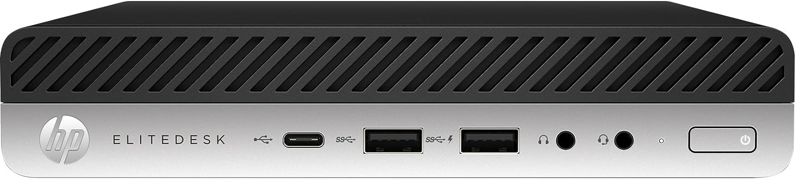

One Christmas long ago my brother and I got a Sega Genesis. We were thrilled and lost our shit. But as soon as all the jumping around with joy had ended, my first impulse was not to run to the TV to set it up. What I really wanted to do was call my best friend Tom so I could tell him about it, because talking about a new toy is sometimes just as fun as playing with it. My mom didn't want me calling and disturbing his family on a holiday though, so I'd have to wait a hundred thousand years (24hrs) to tell him about it.

But as it turned out, a Christmas miracle was about to take place, because an hour later, Tom ended up calling me. He didn't even say "Hi" when I got to the phone. "Josh, guess what, I got a Sega!" he said. We both screamed and then I said, "Tom, guess what, I got one too!" and then more yelling.

All of this is to say that this post isn't a tutorial, it's just me screaming out to anyone who might possibly care, "I set up a new Plex server that also does torrents over VPN!" A bit more of a mouthful than "I got a sega", but for me, just as exciting.

## The Old Way

Until recently, I had been running my Plex media server on an old laptop. This had two significant downsides. First of all, I often wanted to use the laptop, but could not because it was sitting up on a shelf connected to ethernet and an external hard drive. Second, sometimes I wanted to use the laptop to download legal torrents of Linux distributions and only legal torrents of Linux distributions. For personal reasons that are not your business, I preferred that these distros were downloaded to the same machine as the Plex. The problem was that whenever I wanted to torrent something, I needed to turn on my VPN which made the Plex unusable. Quite the bummer when all you want to do while waiting for a torrent to download is watch another episode of Max Headroom.

So I needed a better solution. I had two criteria.

1. The new way needed to be cheap. I wasn't looking to buy an expensive new computer or NAS. Running the Plex isn't that demanding of a job, so I knew I could get away with a low-powered machine.

2. I wanted to be able to download torrents on the same machine, over VPN, without interrupting the Plex usage.

These two criteria had two simple solutions.

1. I would use an old used mini PC as a dedicated server, freeing up my laptop.

2. I would run everything in Docker, which would allow me to download torrents over my VPN without interfering with my Plex setup.

Here's what I learned and how my setup ended up looking in the end.

## A $70 Computer



For the computer I landed on an HP EliteDesk 800 G3 35W Mini PC with an Intel i5. I chose this mainly because of [this great video](https://www.youtube.com/watch?v=amVP96OYfUg&list=WL&index=12&t=206s), and also because it was small and the price was right. I found one for $70 on eBay that came with the power adapter, 8 gigs of RAM, and nothing else. This was fine. I keep all my Plex media on an external hard drive, so I just added a 500GB SSD for around $35.[^1]

I've been running this setup for a few weeks now and it works great, even when connecting tot he Plex remotely.

## Docker Networking With a VPN

Probably the most interesting part of my setup was that I got to learn a lot more about Docker Networking. In particular, that you can set a container's network to be another container, which is pretty kick-ass.

### Plex

So there are two parts to my setup. First, the Plex. Luckily, Plex has an [official docker image](https://hub.docker.com/r/plexinc/pms-docker/), so setting it up was extremely simple. For now, I have the Plex using my host network. I've seen a lot of people saying you should never use the host network. From what I can tell, the biggest reason is to avoid conflicts with other services that might need to use the same ports. Since I don't have anything else running at the moment that conflicts, this was just the fastest and easiest way to get up and running quickly, so that's what I'm using right now. Eventually, I'm going to switch to the Macvlan Networking setup that Plex suggests using, but for now, it is what it is.

### Torrents

The other part of my setup is the VPN + torrenting part. Originally, I had thought maybe I'd have to create my own image, possibly pulling from an existing VPN image or something like that.

The actual solution turned out to be much easier once I realized you can set a container's network to just be another container. Literally, `docker run --network container:nameOfVPNContainer`. Pretty cool.

I use transmission for torrents. [LinuxServer.io](https://www.linuxserver.io/) has a very popular and well-maintained [image](https://hub.docker.com/r/linuxserver/transmission) for transmission that's been working great for me so far.

I tried running a dedicated NordVPN container, but I had some issues with it that I already forgot about and so can not share with you. What I can tell you is that, eventually, I found [gluetun](https://hub.docker.com/r/qmcgaw/gluetun), and everything just fell into place after that. Gluetun is an all-purpose VPN client. It works with dozens of VPN providers. All you need to do is provide it with some credentials, and Gluetun sets everything else up for you. So far it's been an excellent solution for me. There's also a great getting started video right on the [GitHub page](https://github.com/qdm12/gluetun).

The only small issue I had was related to NordVPN. You can't use your normal username and password to log in remotely, which is a good thing. Instead, **you need to create a special service token and password**. That's not really an issue. The issue was that it wasn't super clear on their site that you needed to do this, or even how you are supposed to do this [^2]. I had to read about it on Stackoverflow. In fact, NordVPN surprisingly didn't have much on their site about running a VPN in a Docker container. The most I could find was this [brief page](https://support.nordvpn.com/Connectivity/Linux/1507838432/How-to-build-the-NordVPN-Docker-image.htm) about running the CLI, but nothing related to what I wanted to do, which was to have other containers be able to connect to the VPN.

Situations like this always make me wonder if this is a lack of documentation on their part, or just an extreme lack of knowledge on my part.

Either way, once all this was set up everything started working exactly as I'd hoped. I could torrent Legal Linux distros with ease, over VPN, and watch 90's bullshit Sci-Fi TV at the same time. Dreams really do come true.

And, bonus, I've freed my laptop, and am currently using it to write this post. I'll let you decide if that's a good thing or not.

Here's my completed Docker Compose file for the torrent + VPN part, if you are interested.

```yml
version: "3.8"

services:
  gluetun:
    container_name: gluetun
    image: qmcgaw/gluetun
    cap_add:
      - NET_ADMIN
    devices:
      - /dev/net/tun:/dev/net/tun
    ports:
      - 9091:9091 # Web UI port
      - 51413:51413 # Torrent port (TCP)
      - 51413:51413/udp # Torrent port (UDP)
    volumes:
      - ~/gluetun:/gluetun
    environment:
      - CITY="Add Some Cities Here"
      - VPN_SERVICE_PROVIDER=nordvpn
      - VPN_TYPE=openvpn
      - OPENVPN_USER=replace with your user
      - OPENVPN_PASSWORD=replace with your password
  transmission:
    image: lscr.io/linuxserver/transmission
    container_name: transmission
    network_mode: container:gluetun
    environment:
      - PUID=1000 # User id
      - PGID=1000 # Group id
      - TZ=GMT-5# Your current timezone
    volumes:
      - /transmission/docker/config/Transmission:/config # Change this to your docker config folder
      - /transmission/downloads:/downloads/complete # Change this to your download folder
    restart: unless-stopped # This makes sure that the application restarts when it crashes
```

One last note to mention, whenever you use a container as a network, **you'll need to move any port mappings from the client container (in this case transmission), up to the network container (in this case Gluetun)**. This tripped me up a bit at first.

## What I Learned


Honestly, what I learned most while setting this all up is that I have a lot to learn. I'd love to do a deep dive into how the Gluetun image works. I don't really understand OpenVPN on any kind of deep level. I did learn a lot about Docker networking, how the different types work and when to use them.

[^1]: A quick note on this: I had issues getting the machine to recognize my M.2 SSD, which was frustrating. At first, I thought maybe I'd bought a faulty drive, or that it just wasn't compatible. Thankfully I found an answer on [this message board](https://forum.manjaro.org/t/can-t-see-new-m-2-ssd/34035) which suggested turning off all of the HP security settings in the BIOS. After I did this, the drive worked perfectly and I was able to install Linux without any issues. Were these security settings important? I'll let you know if I ever find out.

[^2]: If you're in the same boat, you can easily create the token on the Nord website. In **Services > NordVPN** scroll all the way to the bottom to the section **Manual Setup**. Click on **Setup NordVPN Manually**. Here you can create a new token and password that will allow you to log into NordVPN via the Gluetun docker image.
