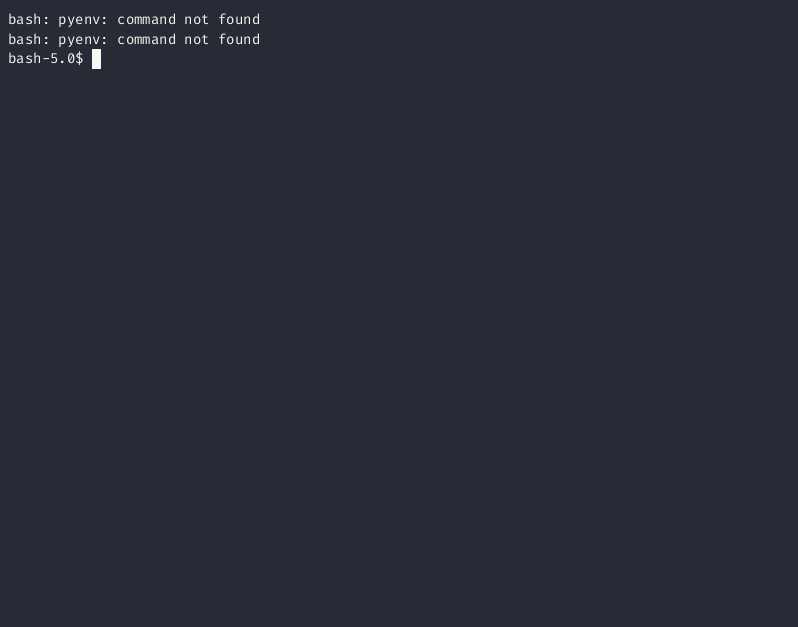

I had a lot of files on a server that needed to be renamed. At first I would just write a script to rename them. But soon this got really tedious. On my Mac I have a program called [Transmino](https://www.transnomino.com/) to do batch renaming of files. It let's you find and replace in hundreds of files at once, use regex expressions, set prefixes, number files and way more. It's great, but it's graphical, and only for Mac. I needed something I could use on a Linux server with no GUI. There were some solutions out there. I believe [nnn](https://github.com/jarun/nnn) can do this or at least something similar.

But pretty quickly I realized that this wouldn't be that hard to just build myself, and since I really enjoy making terminal apps, it would be fun to make. And it was.

## A Simple File Navigator



I called the app `rn` for Rename. I now see that this is way too similar to `rm`, so that was probably a mistake. Oh well.

When you run it, it uses your current directory as root for a tree structure. This was helpful for me when I have a lot of different documents to rename so I can track my progress. A lot of the times the rename is just removing a few characters. In other cases I need to complete change the original file name. Often I would want to be able to see the files and the folders together, since a common use case for me was to rename the folder and then have to rename the files to match in some way. So something similar to:

```text
.
└── This is Great (2001)/
    ├── This is Great (2001).file
    └── This is Great (2001).txt
```

The other thing I like is that I can rename everything using a form, which has the added bonus of allowing me to uses spaces and special characters without having to escape them the way you do when you rename something with `mv`.

```bash
$ mv file.txt That\ get\'s\ really\ annoying\ \(as\ you\ can\ see\).txt
```

I can also delete files from here. I added a check to ask "Are you sure?" after several disasters.

## TUI Batch File Rename

But the most useful feature by far, and the real reason I built this, is the ability to open a folder from the tree and rename all the files at once.


Right now this only works with a simple find and replace, but I do plan on adding the ability to use regex soon.

## Using Tview and Tcell

I ended up using Go because I was already familar with the [Tview](https://github.com/rivo/tview) and [Tcell](https://github.com/gdamore/tcell) packages. I'd used tcell directly when creating a [Pong game](https://earthly.dev/blog/pongo/) for the terminal. Tview builds on top of Tcell by giving you different components. Basic structures like text fields, list, and forms. It also gives you an easy to use flexbox type layout. If you're interested in getting started with Tview, I wrote a short [tutorial](https://earthly.dev/blog/tui-app-with-go/) about it.

## The Code

This is just an app for my personal use, but if you're interested, the code is all on my [Github](https://github.com/jalletto/rn). I will say that it's sort of a mess. This is the first real thing I've built with Go and I think the code is organized in a stupid way. But it's a small app and it works. Still, I'd be open to any criticism or ideas for improvement. Feel free to make a condescending PR.
