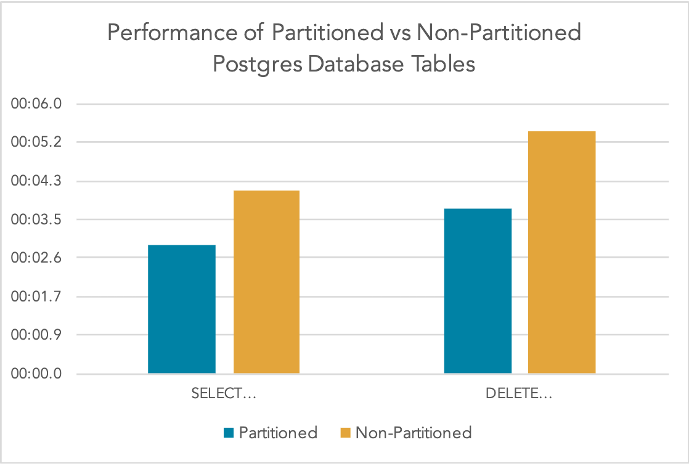
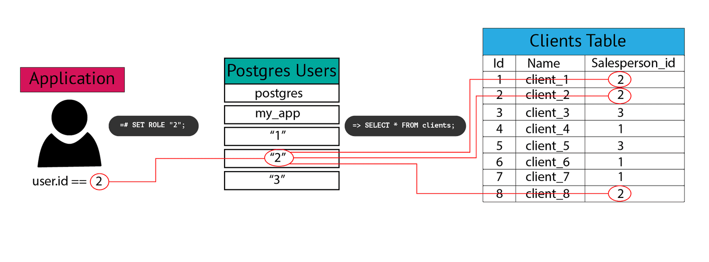

# Check Out Some of My Work

## [PostgreSQL Partitioning in Django](https://pganalyze.com/blog/postgresql-partitioning-django)
{ align=left }
Postgres 10 introduced partitioning to improve performance for very large database tables. You will typically start to see the performance benefits with tables of 1 million or more records, but the technical complexity usually doesn’t pay off unless you’re dealing with hundreds of gigabytes of data.

[Keep reading](https://pganalyze.com/blog/postgresql-partitioning-django){.md-button }

## [Python Code Coverage Using GitHub Actions and Codecov](https://about.codecov.io/blog/python-code-coverage-using-github-actions-and-codecov/)
{ align=left }
In this tutorial, we’ll use a Python package called Coverage to generate a code coverage report locally. Then we’ll utilize the power of Codecov along with GitHub Actions to integrate our coverage report into our pull requests. The code repository is available here or you can follow along to replicate it yourself. 

[Keep reading](https://about.codecov.io/blog/python-code-coverage-using-github-actions-and-codecov/){.md-button }

## [Postgres Row-Level Security in Python and Django](https://pganalyze.com/blog/postgres-row-level-security-django-python)
{ align=left }
Postgres introduced row-level security in 2016 to give database administrators a way to limit the rows a user can access, adding an extra layer of data protection. What's nice about RLS is that if a user tries to select or alter a row they don't have access to, their query will return 0 rows, rather than throwing a permissions error. This way, a user can use `select * from table_name`, and they will only receive the rows they have access to with no knowledge of rows they don't. 

[Keep reading](https://pganalyze.com/blog/postgres-row-level-security-django-python){.md-button }

## [Creating Custom Postgres Data Types in Rails](https://pganalyze.com/blog/custom-postgres-data-types-ruby-rails)
{ align=left }
Postgres ships with the most widely used common data types, like integers and text, built in, but it's also flexible enough to allow you to define your own data types if your project demands it. Say you're saving price data and you want to ensure that it’s never negative. You might create a not_negative_int type that you could then use to define columns on multiple tables. Or maybe you have data that makes more sense grouped together, like GPS coordinates. 

[Keep reading](https://pganalyze.com/blog/custom-postgres-data-types-ruby-rails){.md-button }

## [How to Write Effective Technical Articles](https://draft.dev/learn/posts/technical-tutorials)
{ align=left }
Just because you know a topic well doesn’t mean you’ll crank out a great tutorial on the subject. Here are a few things to keep in mind to help you write informative, engaging, and useful technical tutorials:

[Keep reading](https://draft.dev/learn/posts/technical-tutorials){.md-button }

## [Custom Postgres Data Types In Django](https://pganalyze.com/blog/custom-postgres-data-types-django-python)
{ align=left }
No matter how you decide to define your datatype, Django has the functionality to allow you to map custom column data to model attributes. You can achieve this by extending the Django field class. In this walkthrough, we'll see how to create custom types in Postgres and then use them in Django to ensure consistent data types across your application. We will do this by walking you through an example project.

[Keep reading](https://pganalyze.com/blog/custom-postgres-data-types-django-python){.md-button }